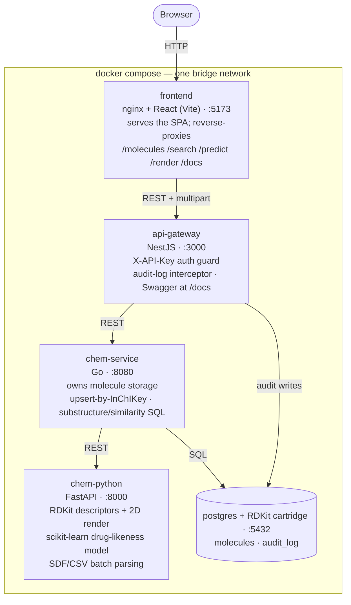

# MolHub — Molecular Screening Platform

MolHub is a service-oriented platform for storing and analyzing molecules: it
computes standard cheminformatics descriptors (MW, LogP, TPSA, H-bond donors/
acceptors, ring count, Lipinski Rule-of-Five drug-likeness) via RDKit, renders
2D structure depictions instead of raw SMILES text, lets you search stored
molecules by a SMARTS substructure or by Tanimoto similarity (Morgan
fingerprints), predicts drug-likeness with a small scikit-learn model — a
QSAR-style demo that goes structure → property directly from a fingerprint,
without computing descriptors at inference time — and plots the whole
collection on a LogP-vs-MW "chemical space" scatter.

Backend is NestJS (API gateway, auth, audit trail) + Go (molecule storage) +
FastAPI/RDKit (cheminformatics + ML) + PostgreSQL with the RDKit cartridge
(structural search in SQL). Frontend is React + Ant Design. The whole stack —
including the UI — starts with one `docker compose up`.

Built as a portfolio project bridging a software engineering background with
a Master's in Chemical Sciences and prior cheminformatics/lab-automation
research (the "Chemputer" project, University of Glasgow) — to show that
combination concretely rather than just list it. No CI/CD here by design;
this is meant to be read and run, not deployed.

## Stack

- **frontend** — React + TypeScript (Vite) + Ant Design. Talks to the api-gateway.
- **api-gateway** — NestJS (TypeScript). HTTP entrypoint, Swagger docs at `/docs`.
- **chem-service** — Go. Owns molecule storage; talks to Postgres and to chem-python.
- **chem-python** — FastAPI + RDKit. Canonicalizes SMILES, computes descriptors, renders 2D
  structure SVGs, and serves a small scikit-learn drug-likeness classifier (see
  [Predicting drug-likeness](#predicting-drug-likeness-qsar-demo)).
- **postgres** — PostgreSQL with the RDKit cartridge extension (structural search).

## System design



Every hop past the frontend requires the `X-API-Key` header, checked once at
the api-gateway; chem-service and chem-python trust requests that already
made it past that guard rather than re-checking it themselves. api-gateway
and chem-service each hold their own connection to the same Postgres instance
— api-gateway writes `audit_log` directly (a cross-cutting concern, not a
molecule-storage one), while chem-service owns the `molecules` table and all
RDKit-cartridge SQL (substructure containment, Tanimoto similarity). The ML
model chem-python serves is trained into the image at `docker build` time
(see [Predicting drug-likeness](#predicting-drug-likeness-qsar-demo)), not at
request time — inference is just a fingerprint + a forward pass through an
already-loaded scikit-learn model.

## Running locally

One command brings up the whole stack (postgres, chem-python, chem-service,
api-gateway and the frontend):

```bash
cp .env.example .env   # first time only
docker compose up --build
```

- **frontend: http://localhost:5173** — the UI, ready to use with no setup (the
  demo API key is baked in, not something you need to enter). Every tab has
  clickable "Try:" example chips (aspirin, caffeine, ibuprofen, ...) so you
  don't need to know SMILES/SMARTS syntax to explore it.
- api-gateway: http://localhost:3000 (Swagger at `/docs`)
- chem-service: http://localhost:8080
- chem-python: http://localhost:8000

The frontend is a static React build served by nginx, which also reverse-proxies
`/molecules`, `/search`, `/health` and `/docs` to the api-gateway container — no
CORS setup or extra ports to open, one process per `docker compose up`.

### Frontend-only dev loop

For hot-reload while working on the UI, run the frontend outside Docker instead
of rebuilding the image on every change (everything else can stay in Docker):

```bash
cd frontend
npm install
npm run dev
```

This starts a Vite dev server on http://localhost:5173 that proxies API calls to
`localhost:3000`, so keep `docker compose up` running for the backend.

## Try it

`/molecules`, `/search/*` and `/audit` require an `X-API-Key` header. Keys are
configured via `API_KEYS` in `.env` (`name:key` pairs, comma-separated); the
default dev key is `demo-key-change-me`.

```bash
curl -X POST http://localhost:3000/molecules \
  -H "Content-Type: application/json" \
  -H "X-API-Key: demo-key-change-me" \
  -d '{"smiles": "CC(=O)OC1=CC=CC=C1C(=O)O"}'

curl -H "X-API-Key: demo-key-change-me" \
  "http://localhost:3000/molecules?druglike=true&limit=20&offset=0"

curl -X POST http://localhost:3000/search/substructure \
  -H "Content-Type: application/json" \
  -H "X-API-Key: demo-key-change-me" \
  -d '{"smarts": "c1ccccc1"}'

curl -X POST http://localhost:3000/search/similarity \
  -H "Content-Type: application/json" \
  -H "X-API-Key: demo-key-change-me" \
  -d '{"smiles": "CC(=O)OC1=CC=CC=C1C(=O)O", "threshold": 0.7}'

curl -H "X-API-Key: demo-key-change-me" "http://localhost:3000/audit?limit=20"

curl -X POST http://localhost:3000/predict/druglike \
  -H "Content-Type: application/json" \
  -H "X-API-Key: demo-key-change-me" \
  -d '{"smiles": "CC(=O)OC1=CC=CC=C1C(=O)O"}'

curl -X POST http://localhost:3000/render \
  -H "Content-Type: application/json" \
  -H "X-API-Key: demo-key-change-me" \
  -d '{"smiles": "CC(=O)OC1=CC=CC=C1C(=O)O"}'

curl -X POST http://localhost:3000/molecules/batch \
  -H "X-API-Key: demo-key-change-me" \
  -F "file=@molecules.csv" -F "format=csv"
```

## Predicting drug-likeness (QSAR demo)

`POST /predict/druglike` is a small machine-learning add-on next to the deterministic
Lipinski rule already computed on every stored molecule: a scikit-learn `RandomForestClassifier`
trained to predict rule-of-five compliance **from a Morgan fingerprint alone**, without computing
MW/LogP/TPSA/etc at inference time — a minimal QSAR-style structure-to-property model. The
response includes both the model's prediction (with probability) and the rule-based ground
truth, so you can see where the two agree or disagree.

The model trains at `chem-python` Docker build time (`app/ml/train.py`, ~3s), on ~2,600
molecules built from a public solubility dataset plus synthetic combinations added to balance
the drug-like/non-drug-like classes — see `chem-python/data/README.md` and the docstring at the
top of `train.py` for exactly how and why. Nothing here needs the internet at build time; the
dataset is checked into the repo.

## Bulk import (ETL)

`POST /molecules/batch` is a small extract/transform/load pipeline: **extract**
molecules from an uploaded SDF or CSV/SMILES-per-line file (`chem-python`'s
`app/batch.py`, using RDKit's `ForwardSDMolSupplier` for SDF), **transform**
each one through the same descriptor calculation `/analyze` uses, **load**
every valid row into Postgres with the same upsert-by-InChIKey behavior as
adding one molecule by hand. A malformed row (bad SMILES, an unparseable SDF
block) fails only that row — the response reports per-row success/failure
instead of rejecting the whole batch, capped at 500 rows / 10MB. This is the
realistic version of "adding a molecule": in practice a chemist has a file of
hundreds of compounds, not one SMILES typed into a form.

## Visualizations

- **2D structures.** `POST /render` draws a SMILES to an SVG via RDKit's `Draw`
  module; the frontend shows this instead of raw SMILES text wherever a
  molecule appears (the molecule table, the Predict tab's result), with a
  small module-level cache so the same molecule isn't re-fetched per row.
- **Chemical space dashboard.** The frontend's Dashboard tab plots every
  stored molecule by LogP (x) vs molecular weight (y) — the classic
  medicinal-chemistry "chemical space" scatter — colored **and shaped**
  (circle/triangle) by Lipinski drug-likeness. Color alone doesn't survive
  red-green color blindness (the red/green pair measures ΔE 4.1 under a
  deutan simulation, well under the accessibility floor), so shape carries
  the distinction and color only reinforces it.

## Status

Phases 1-4 (store/read molecules, drug-likeness filter, substructure search,
similarity search) are implemented end to end, plus a React/Ant Design frontend,
API-key auth, an audit trail (`audit_log` table, `GET /audit`), a small
drug-likeness classifier (`POST /predict/druglike`), 2D structure rendering
(`POST /render`), a chemical-space dashboard, and a bulk SDF/CSV import
pipeline (`POST /molecules/batch`).
